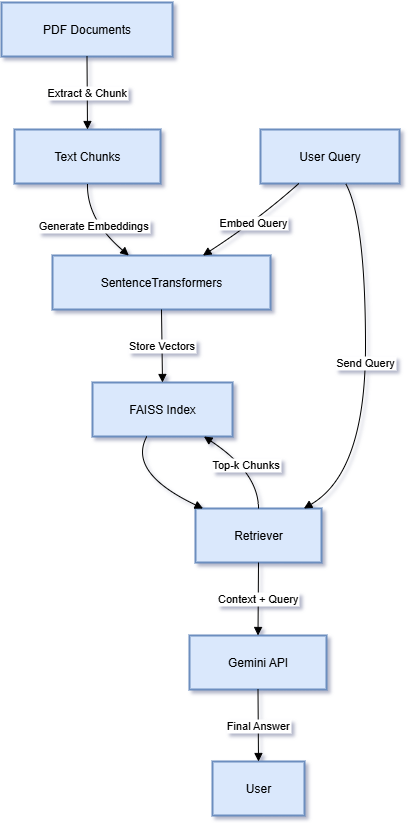

# 📖 RAG-based Enterprise Search System

A prototype **Retrieval-Augmented Generation (RAG)** system for enterprise document search.  
It ingests PDF files, performs **semantic search with FAISS**, and generates **context-aware answers** using **Google Gemini 2.5 Flash**.  

This project demonstrates how **Generative AI + RAG** can transform large unstructured document collections into **actionable insights**.  

---

## ✨ Features
- 📑 **PDF Ingestion** – Extracts and splits text from PDFs into manageable chunks.  
- 🧠 **Semantic Embeddings** – Generates vector embeddings using **SentenceTransformers**.  
- 🔍 **Vector Search** – Stores embeddings in a **FAISS index** for fast similarity search.  
- 🏷️ **Metadata Tracking** – Maintains source file, page number, and chunk index.  
- 🤖 **RAG Querying** – Retrieves top chunks + uses **Gemini API** for AI-generated answers.  
- 🔌 **Extensible Design** – Add more documents or extend to other file formats easily.  

---

## 🛠️ Tech Stack
- **Python 3.8+**  
- [Google Generative AI SDK](https://pypi.org/project/google-generativeai/)  
- [PyPDF2](https://pypi.org/project/PyPDF2/)  
- [SentenceTransformers](https://www.sbert.net/)  
- [FAISS](https://github.com/facebookresearch/faiss)  

## 📊 System Architecture



```bash
pip install google-generativeai pypdf2 faiss-cpu sentence-transformers numpy
```
## 🚀 How It Works

### PDF Ingestion

- The system reads a PDF file using **PyPDF2**.
- Each page's text is extracted and split into chunks (default: 1000 characters, preserving sentence boundaries).
- Each chunk is embedded into a vector using a pre-trained **SentenceTransformer** model (`all-MiniLM-L6-v2`).
- Embeddings are stored in a **FAISS** index for efficient similarity search.
- Metadata (source file, page number, chunk index) is stored for traceability.

### Querying

- User submits a natural language query.
- The query is embedded using the same **SentenceTransformer** model.
- FAISS retrieves the top-k most similar document chunks.
- The retrieved chunks are concatenated as context.
- A prompt is constructed and sent to **Gemini (Google Generative AI)** to generate a final answer.

---

## Usage

### 1. Setup
- Clone this repository.
- Place your PDF files (e.g., `mentalpolicy.pdf`) in the project directory.
- Obtain a Google Gemini API key and set it in the notebook or script.

### Running the System

Open `main.ipynb` and run the cells in order.

### 🎯 Project Highlights

- ✔️ Demonstrates end-to-end RAG pipeline (ingestion → embeddings → retrieval → generation)
- ✔️ Showcases enterprise knowledge search with Generative AI
- ✔️ Built to be modular, extensible, and easy to demo

### 🧑‍💻 Author

- Your Name : Abhishek Tiwari

- LinkedIn : https://www.linkedin.com/in/abhishek-tiwari-30289a1a7/


